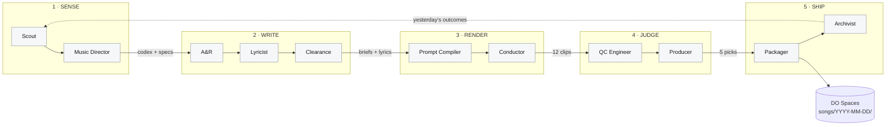
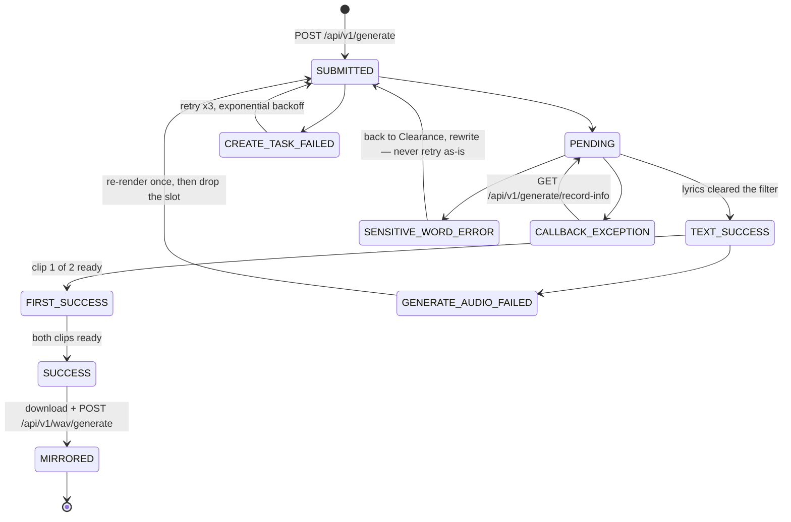

# The Daily Five — architecture

An unattended pipeline that produces **five finished songs every day** — WAV, MP3,
cover art and timestamped lyrics — into a dated folder on DigitalOcean Spaces.

Status: **proposal, v0.1.** No code yet. This document is the thing to agree on first.

Visual version (diagrams, cost tables, roster): see the published architecture page
linked from the PR/issue this branch came from.

---

## 1. Contract

| | |
|---|---|
| Ships daily | 5 songs — `master.wav`, `master.mp3`, `cover.jpg`, `lyrics.lrc`, `meta.json` |
| Renders daily | 12 candidates (6 generations x 2 clips) |
| Storage | DigitalOcean Spaces, one immutable dated folder per run |
| Run window | ~90 minutes, mostly spent waiting on Suno |
| Attention required | none, by design |

---

## 2. Four constraints that shape the design

### 2.1 A producer who picks 5 of 5 is not a producer

Selection only means something when there is a surplus. Suno returns **two clips per
generation call**, so six generations yield twelve candidates. Twelve in, five out —
and every rejected clip becomes a labelled training example.

### 2.2 Nothing in a purely-LLM roster catches a broken file

Suno fails in ways no model can hear by reading a prompt: tracks that end mid-bar,
near-silence with a noise tail, hard clipping, a "3 minute" song that came back at 47
seconds. This needs **measurement, not judgment**, and it must run before anyone
listens. See the QC Engineer role — deliberately the one role with no LLM in it.

### 2.3 There is no free "what's trending on TikTok" API

TikTok's Research API is academic-access only; Creative Center trend pages have no
public API and scraping them breaches terms. The `tiktok_music_trending` tooling
available in this workspace is a **Commercial Music Library picker** for attaching a
licensed track to a video you post — it requires a connected TikTok account and says
nothing about what is rising.

The Scout must therefore be **signal fusion** across sources that do have real access,
each weighted by how leading it is.

### 2.4 "Learns how hits are made" is a no-op unless something writes it down

An agent that starts fresh every morning re-derives the same generic answer forever.
Learning requires three concrete things: a durable versioned **Style Codex**, a
**record of every clip** including failures, and an **outcome signal** to join them
against. The third is an open decision — see §8.

---

## 3. The roster — 11 agents

Six added to the five originally proposed. Each is justified by the specific failure it
prevents.

| # | Agent | Status | Prevents | LLM |
|---|---|---|---|---|
| 01 | **Scout** | re-scoped | Making music for a mood that peaked three weeks ago | Claude |
| 02 | **Music Director** | re-scoped | Prompts made of adjectives instead of specifications | Claude |
| 03 | **A&R** | **added** | Five songs that are the same song | Claude |
| 04 | **Lyricist** | kept | Generic AI lyric mush | MiniMax M3 |
| 05 | **Clearance** | **added** | `SENSITIVE_WORD_ERROR` burning credits at 2am | rules first, model second |
| 06 | **Prompt Compiler** | re-scoped | Silent truncation, invalid param combinations | light |
| 07 | **Conductor** | **added** | One dropped webhook killing the whole day | none |
| 08 | **QC Engineer** | **added** | Shipping a track that clips or is 40s of silence | none |
| 09 | **Producer** | kept | Shipping the first five instead of the best five | Claude |
| 10 | **Packager** | **added** | A bucket of untitled WAVs you cannot use | light |
| 11 | **Archivist** | **added** | Day 30 being exactly as good as day 1 | weekly retro only |

**Four of eleven have no model in them at all.** That is what makes the system cheap
enough to run 365 days a year and reliable enough to run unattended. Put a language
model where a measurement belongs and you get a system that hallucinates that the
audio is fine.

### Role detail

- **Scout** — fuses trend feeds into one ranked signal sheet: rising sounds, tempo
  bands, sentiment clusters, phrases people are typing. Weights each source by how
  leading it is. Out: `signals.json`, 8-12 ranked themes with evidence.
- **Music Director** — owns the **Style Codex**: a versioned, checkable document of
  production specs (BPM bands, key/mode, song form, hook placement, drop timing,
  instrumentation palette, vocal register, mix reference). Encodes *characteristics*,
  never "in the style of [named artist]" — which Suno rejects anyway.
- **A&R** — turns themes and specs into six concrete briefs, enforcing spread across
  genre, tempo, vocal gender and mood, checked against the last 14 days.
- **Lyricist** — two drafts per brief, self-selects one, works to the Director's song
  form so structure tags match the arrangement the prompt requests.
- **Clearance** — deterministic blocklist pass, then a model pass. Named living
  artists, lyric fragments echoing real songs, trademarks, filter-tripping language.
- **Prompt Compiler** — compiles a brief into a valid Suno payload and nothing else.
  Enforces per-model character limits before the request leaves the building.
- **Conductor** — not creative. Fires generations, receives webhooks, polls when they
  do not arrive, retries with backoff, tracks spend against a daily cap, mirrors every
  asset to Spaces the moment it exists.
- **QC Engineer** — true peak, integrated LUFS, real vs. requested duration, leading
  and trailing silence, dead-air ratio, DC offset, hard-clip count. Rejects on
  thresholds; survivors normalised to -14 LUFS with a clean fade.
- **Producer** — three independent scoring passes (hook strength in the first seven
  seconds, vocal and mix quality, fit to today's trend sheet), picks five, writes down
  why each rejection lost.
- **Packager** — requests the true WAV, encodes 320kbps MP3, generates cover art,
  writes ID3 tags and a timestamped `.lrc`, uploads the dated folder and manifest.
- **Archivist** — one row per clip, shipped or not, joining brief, exact style string,
  every parameter, QC metrics, producer score and rejection reason.

---

## 4. Flow



Work moves strictly left to right. The only backwards path is the feedback line, and
it carries data, not control. Note that phase 4 runs `ffmpeg` **before** it calls a
model: broken files are eliminated by measurement before anything spends tokens
forming an opinion about them.

### The funnel

```
6 briefs  ->  12 clips  ->  QC gate  ->  producer  ->  5 shipped
                            ~9 pass                    4 held as reference
                            ~3 cut                     (rejection reasons logged)
```

Everything left of the producer runs **per-clip and independently** — a slow generation
does not hold up the others. The producer is the single barrier, because ranking
requires having all survivors in hand at once. Build the left side as an independent
per-item pipeline, not as synchronised stages.

---

## 5. The Suno job state machine

Suno is asynchronous: POST a request, get a `taskId`, audio arrives by webhook minutes
later. Every serious failure mode lives in that gap.



Two rules do most of the work:

1. **Always poll as well as listen.** Suno abandons a callback after three consecutive
   delivery failures. A pipeline trusting webhooks alone loses the run silently, with
   no error anywhere.
2. **Mirror to Spaces the instant bytes exist.** Generated files are retained for
   **15 days** and download URLs are short-lived. Once a file is in your bucket, every
   Suno-side expiry stops being your problem.

Rate ceiling is 20 requests / 10 seconds — six generations is nowhere near it. The
binding constraints are credits (HTTP 429) and the retention clock, not throughput.

---

## 6. Storage

### DigitalOcean Spaces

```
spaces://<bucket>/songs/2026-08-27/
├─ manifest.json          # 5 entries: title, style, bpm, key, duration, checksums
├─ index.html             # one page, 5 players, signed links (optional)
├─ 01_slow-burn-in-june/
│   ├─ master.wav         # Suno WAV, loudness-normalised to -14 LUFS
│   ├─ master.mp3         # 320 kbps, ID3 tags + embedded cover
│   ├─ cover.jpg          # 3000x3000, Seedream
│   ├─ lyrics.txt
│   ├─ lyrics.lrc         # timestamped, from Suno's aligned lyrics
│   └─ meta.json          # brief, full style string, every parameter, QC metrics
├─ 02_… 03_… 04_… 05_…
└─ _rejected/             # the 7 that did not ship, MP3 only, with reasons
    └─ rejects.json
```

### Postgres — 8 tables

`runs`, `signals`, `codex_versions`, `briefs`, `jobs`, `clips`, `decisions`,
`outcomes`. The Conductor needs it for crash-safe resume; the Archivist needs it for
the loop. SQLite works on day one, but real concurrent writes are wanted once webhooks
are landing.

The `clips` row is the learning record — one per candidate, **written whether or not it
shipped**:

```
brief_id · theme · diversity_vector
style_string · negative_tags
model · vocal_gender
style_weight · weirdness · audio_weight
bpm_target · key · song_form
lyric_hash · lyric_text
qc: lufs · true_peak · duration_delta · silence_ratio · clip_count · verdict
producer: hook · mix · trend_fit · rank
shipped: true|false
reject_reason          <- the whole point
outcome: plays · saves · your_rating    <- the field the system cannot fill in itself
```

Those rows drive three updates: the **Style Codex**, **brief diversity rules**, and
**prompt defaults**. Together they are the only thing making day 30 better than day 1.

### Host

A single $12-24/month droplet: a cron entry, a worker process, a small webhook
endpoint on a public HTTPS URL. No GPU — all heavy lifting is somebody else's API.
Two easy-to-miss requirements: the webhook endpoint must be **publicly reachable**, and
**ffmpeg must be installed** (QC and MP3 encoding both depend on it).

---

## 7. Provider assignment

> **Correction to the original plan:** ModelArk cannot write the lyrics. The BytePlus
> ModelArk integration available here is **image, video and 3D only** (Seedream,
> Seedance, Hyper3D) — no text surface is exposed. Reassign: **MiniMax M3 writes the
> lyrics**, and **ModelArk does cover art** via Seedream, which the pipeline needs
> anyway and which nothing else on the list does well.

| Provider | Used for | Called by | Notes |
|---|---|---|---|
| sunoapi.org | music generation, WAV conversion, aligned lyrics | Conductor, Packager | the only irreplaceable dependency |
| MiniMax | lyrics (M3); optional second music supplier | Lyricist | music billing needs a pay-as-you-go balance, not just a plan key |
| BytePlus ModelArk | cover art (Seedream); optional video loops (Seedance) | Packager | no text models exposed — art only |
| Claude | Scout, Director, A&R, Clearance, Producer | 5 agents | the reasoning-heavy roles |
| ffmpeg / librosa | QC measurement, mastering, MP3 encode | QC, Packager | local, free, deterministic |
| DO Spaces | every artefact, forever | Conductor, Packager | S3-compatible; set a lifecycle rule |

### Suno endpoints in use

| Endpoint | Purpose |
|---|---|
| `POST /api/v1/generate` | main generation — returns `taskId`, 2 clips per call |
| `GET /api/v1/generate/record-info` | poll fallback when a callback does not arrive |
| `POST /api/v1/wav/generate` | true WAV conversion for the 5 picks |
| `POST /api/v1/lyrics` | lyrics fallback (200-char prompt cap) |
| `POST /api/v1/vocal-removal/generate` | optional stems — 2, 12 or single-instrument |
| `GET /api/v1/generate/credit` | budget guard, called before and after each run |

Character limits by model (enforced by the Compiler, not discovered at runtime):
`style` 200 chars on V4 but 1000 on V4_5+; `prompt` 3000 on V4, 5000 on V4_5+;
`title` 80-100. V5_5 additionally accepts an explicit `duration` of 10-360 seconds.

### Estimated daily cost

| Line | Per day | Est. USD/day |
|---|---|---|
| Suno generations | 6 calls -> 12 clips | **confirm against your plan** |
| Suno WAV conversion | 5 tracks @ ~$0.05 | 0.25 |
| Lyrics (MiniMax M3) | 12 drafts | ~0.05 |
| Cover art (Seedream) | 5 images | ~0.20 |
| Claude — 5 agent roles | ~15 calls | ~0.60 |
| Droplet + Spaces | always on | ~0.60 |
| **Everything except Suno** | 5 finished songs | **~$1.70/day (~$50/mo)** |

Published figure for WAV conversion is $0.05/track; credits run ~$0.005 at entry tiers
with plans from $19-199/month. Generation credit cost varies by model version — call
`GET /api/v1/generate/credit` before and after one manual test generation and you have
the exact number in a minute.

---

## 8. Open decisions

These change the shape of the build and should be settled before code is written.

1. **Where does the outcome signal come from?** A daily rating from you, real
   play/save metrics, or a weekly manual review. Without one, the loop optimises for
   the Producer's taste rather than reality.
   *Recommend: a 30-second daily rating to start, real metrics later.*
2. **One artist, or a different act every day?** Suno personas keep a voice consistent
   across releases, which is what builds a followable catalogue.
   *Recommend: 2-3 recurring personas rotating across the five slots.*
3. **Full songs, or clip-length?** V5_5 takes an explicit 10-360s duration. TikTok
   means 30-60s loopable hooks; a catalogue means 2.5-3.5 minute songs. Different
   products, different briefs.
   *Recommend: 3 full songs plus 2 short-form cuts per day.*
4. **Which trend sources are worth paying for?** Free gets YouTube trending, Google
   Trends, Reddit, public charts — decent but lagging. Chartmetric/Soundcharts give
   real TikTok and Shazam velocity for ~$100-500/month.
   *Recommend: start free, add a paid feed once the loop is closed.*
5. **Does this ever publish, or only archive?** Distribution later changes what
   Packager writes today (ISRCs, split sheets, platform artwork sizes) and is much
   cheaper to design in now than to retrofit across a back catalogue.
   *Recommend: archive-only now, distribution-ready metadata from day 1.*

---

## 9. Build order

1. **Spine first, no intelligence.** Conductor, webhook receiver, job state machine,
   Spaces mirroring. One hard-coded brief end to end, until it runs five days straight
   untouched.
2. **QC and Packager next.** Now a run produces something worth having. Still no agents.
3. **Then the creative roster**, in dependency order: Compiler, Lyricist, A&R,
   Director, Scout, Producer, Clearance.
4. **Archivist last**, once there is a week of real rows to learn from.

The order matters. The agents are the easy half; the half that decides whether this is
still running in six months is the boring spine — retries, idempotency, and never
losing a file.

---

*Suno API surface verified against <https://docs.sunoapi.org/>, August 2026 —
endpoints, model versions, character limits, rate ceiling, callback semantics and the
15-day retention window. Figures marked "est." are estimates, not quotes.*
