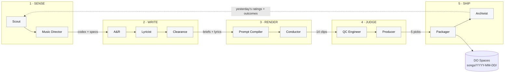
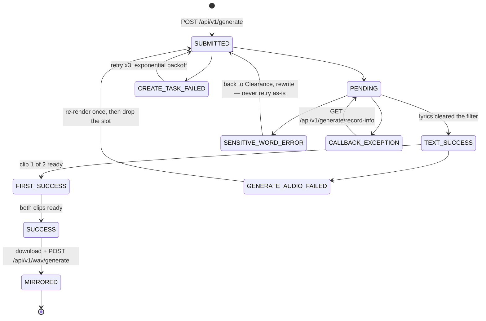

# The Daily Five — architecture

An unattended pipeline that produces **five finished songs every day** — WAV, MP3,
cover art and timestamped lyrics — into a dated folder on DigitalOcean Spaces.

Status: **v0.3 — implemented.** All five decisions settled; 93 tests pass.
Nothing has run against a live API yet because no credentials are configured.
See the README for setup.

Visual version (diagrams, cost tables, roster): see the published architecture page
linked from the PR/issue this branch came from.

---

## 1. Contract

| | |
|---|---|
| Ships daily | 5 songs — 3 full-length, 2 short-form — as `master.wav`, `master.mp3`, `cover.jpg`, `lyrics.lrc`, `meta.json` |
| Renders daily | 14 candidates (7 generations x 2 clips) |
| Storage | DigitalOcean Spaces, one immutable dated folder per run |
| Run window | ~90 minutes, mostly spent waiting on Suno |
| Attention required | ~30 seconds — you rate the five, which closes the learning loop |

---

## 2. Four constraints that shape the design

### 2.1 A producer who picks 5 of 5 is not a producer

Selection only means something when there is a surplus. Suno returns **two clips per
generation call**, so seven generations yield fourteen candidates. Fourteen in, five
out — and every rejected clip becomes a labelled training example.

### 2.2 Nothing in a purely-LLM roster catches a broken file

Suno fails in ways no model can hear by reading a prompt: tracks that end mid-bar,
near-silence with a noise tail, hard clipping, a "3 minute" song that came back at 47
seconds. This needs **measurement, not judgment**, and it must run before anyone
listens. See the QC Engineer role — deliberately the one role with no LLM in it.

### 2.3 There is no free "what's trending on TikTok" API

TikTok's Research API is academic-access only; Creative Center trend pages have no
public API and scraping them breaches terms. The `tiktok_music_trending` tooling
available in this workspace is a **Commercial Music Library picker** for attaching a
licensed track to a video you post — it requires a connected TikTok account and says
nothing about what is rising.

The Scout must therefore be **signal fusion** across sources that do have real access,
each weighted by how leading it is.

### 2.4 "Learns how hits are made" is a no-op unless something writes it down

An agent that starts fresh every morning re-derives the same generic answer forever.
Learning requires three concrete things: a durable versioned **Style Codex**, a
**record of every clip** including failures, and an **outcome signal** to join them
against. The third is an open decision — see §8.

---

## 3. The roster — 11 agents

Six added to the five originally proposed. Each is justified by the specific failure it
prevents.

| # | Agent | Status | Prevents | LLM |
|---|---|---|---|---|
| 01 | **Scout** | re-scoped | Making music for a mood that peaked three weeks ago | any brain |
| 02 | **Music Director** | re-scoped | Prompts made of adjectives instead of specifications | any brain |
| 03 | **A&R** | **added** | Five songs that are the same song | any brain |
| 04 | **Lyricist** | kept | Generic AI lyric mush | any brain |
| 05 | **Clearance** | **added** | `SENSITIVE_WORD_ERROR` burning credits at 2am | rules first, then any |
| 06 | **Prompt Compiler** | re-scoped | Silent truncation, invalid param combinations | light |
| 07 | **Conductor** | **added** | One dropped webhook killing the whole day | none |
| 08 | **QC Engineer** | **added** | Shipping a track that clips or is 40s of silence | none |
| 09 | **Producer** | kept | Shipping the first five instead of the best five | any |
| 10 | **Packager** | **added** | A bucket of untitled WAVs you cannot use | light |
| 11 | **Archivist** | **added** | Day 30 being exactly as good as day 1 | weekly retro only |

**Four of eleven have no model in them at all.** That is what makes the system cheap
enough to run 365 days a year and reliable enough to run unattended. Put a language
model where a measurement belongs and you get a system that hallucinates that the
audio is fine.

### Role detail

- **Scout** — fuses seven free feeds into one ranked signal sheet: rising sounds, tempo
  bands, sentiment clusters, phrases people are typing. Weights each source by how
  leading it is. Out: `signals.json`, 8-12 ranked themes with evidence. Source stack in
  §7.
- **Music Director** — owns the **Style Codex**: a versioned, checkable document of
  production specs (BPM bands, key/mode, song form, hook placement, drop timing,
  instrumentation palette, vocal register, mix reference). Also holds the **persona
  cast** — 2-3 recurring acts, each with a fixed voice and sonic territory. Encodes
  *characteristics*, never "in the style of [named artist]" — which Suno rejects anyway.
- **A&R** — turns themes and specs into seven **typed** briefs (four full-length,
  three short-form), assigns each a persona from the cast, and enforces spread across
  genre, tempo and mood, checked against the last 14 days.
- **Lyricist** — two drafts per brief, self-selects one, works to the Director's song
  form so structure tags match the arrangement the prompt requests.
- **Clearance** — deterministic blocklist pass, then a model pass. Named living
  artists, lyric fragments echoing real songs, trademarks, filter-tripping language.
- **Prompt Compiler** — compiles a brief into a valid Suno payload and nothing else,
  including `personaId` and — on short-form briefs only — an explicit `duration`.
  Enforces per-model character limits before the request leaves the building.
- **Conductor** — not creative. Fires generations, receives webhooks, polls when they
  do not arrive, retries with backoff, tracks spend against a daily cap, mirrors every
  asset to Spaces the moment it exists.
- **QC Engineer** — true peak, integrated LUFS, real vs. requested duration, leading
  and trailing silence, dead-air ratio, DC offset, hard-clip count. Rejects on
  thresholds; survivors get a clean trim and fade. Loudness normalisation to -14 LUFS
  is applied to the **MP3 only** — see §6. Implemented with ffmpeg alone
  (`ebur128`, `astats`, `silencedetect`) rather than a signal-processing library:
  ffmpeg is needed for encoding regardless, so this adds no dependency.
- **Producer** — three independent scoring passes (hook strength in the first seven
  seconds, vocal and mix quality, fit to today's trend sheet), then fills each slot
  from its own contest — three full-length, two short — and writes down why each
  rejection lost.
- **Packager** — requests the true WAV, encodes 320kbps MP3, generates cover art at
  3000x3000, writes ID3 tags and a timestamped `.lrc`, uploads the dated folder and
  manifest. Emits the `distribution` block in every `meta.json` — schema present,
  values null.
- **Archivist** — one row per clip, shipped or not, joining brief, exact style string,
  every parameter, QC metrics, producer score and rejection reason.

---

## 4. Flow



Work moves strictly left to right. The only backwards path is the feedback line, and
it carries data, not control. Note that phase 4 runs `ffmpeg` **before** it calls a
model: broken files are eliminated by measurement before anything spends tokens
forming an opinion about them.

### The funnel

```
7 briefs  ->  14 clips  ->  QC gate  ->  producer  ->  5 shipped
4 full                      ~11 pass                   3 full + 2 short
3 short                      ~3 cut                    6 held as reference
```

Surplus is sized per slot type: four full-length briefs contest three slots, three
short-form contest two. A short-form cut cannot fill a full-length slot.

Everything left of the producer runs **per-clip and independently** — a slow generation
does not hold up the others. The producer is the single barrier, because ranking
requires having all survivors in hand at once. Build the left side as an independent
per-item pipeline, not as synchronised stages.

---

## 5. The Suno job state machine

Suno is asynchronous: POST a request, get a `taskId`, audio arrives by webhook minutes
later. Every serious failure mode lives in that gap.



Two rules do most of the work:

1. **Always poll as well as listen.** Suno abandons a callback after three consecutive
   delivery failures. A pipeline trusting webhooks alone loses the run silently, with
   no error anywhere.
2. **Mirror to Spaces the instant bytes exist.** Generated files are retained for
   **15 days** and download URLs are short-lived. Once a file is in your bucket, every
   Suno-side expiry stops being your problem.

Rate ceiling is 20 requests / 10 seconds — seven generations is nowhere near it. The
binding constraints are credits (HTTP 429) and the retention clock, not throughput.

---

## 6. Storage

### DigitalOcean Spaces

```
spaces://<bucket>/songs/2026-08-27/
├─ manifest.json          # 5 entries: title, style, bpm, key, duration, checksums
├─ index.html             # 5 players + the rating control that closes the loop
├─ 01_slow-burn-in-june/
│   ├─ master.wav         # Suno WAV, trimmed and faded — deliberately NOT normalised
│   ├─ master.mp3         # 320 kbps, -14 LUFS, ID3 tags + embedded cover
│   ├─ cover.jpg          # 3000x3000, Seedream — the size every DSP accepts
│   ├─ lyrics.txt
│   ├─ lyrics.lrc         # timestamped, from Suno's aligned lyrics
│   └─ meta.json          # brief, style string, parameters, QC metrics + distribution
├─ 02_… 03_… 04_… 05_…
└─ _rejected/             # the 9 that did not ship, MP3 only, with reasons
    └─ rejects.json
```

### The distribution block

Every `meta.json` carries the fields a distributor will one day ask for. **All of them
stay null.** Nothing in the pipeline fabricates an identifier it has no authority to
issue — the schema is reserved so a back catalogue never needs migrating, not so it can
be filled with plausible-looking guesses.

```json
"distribution": {
  "isrc": null,            "iswc": null,          "upc": null,
  "label": null,           "publisher": null,
  "p_line": null,          "c_line": null,        "release_date": null,
  "primary_artist": null,  "featured": [],        "writers": [],
  "producers": [],         "splits": [],          "platform_ids": {},
  "explicit": null,        "language": null,
  "primary_genre": null,   "secondary_genre": null,   "territories": null
}
```

Four of those — `primary_artist`, `language`, `explicit`, `primary_genre` — are already
recorded elsewhere in the same file, in the persona and musical blocks. A future
backfill is therefore a join over rows you already have, not a re-listen to a year of
audio. That is the whole reason for reserving the shape now.

**One thing this changes about the audio.** The WAV was originally specced normalised to
-14 LUFS. That is right for an archive you listen to and slightly wrong for a delivery
master: DSPs apply their own normalisation, and delivering pre-normalised discards a
headroom decision that cannot be recovered. So the **WAV keeps its original level** —
trimmed and faded only — and -14 LUFS goes on the MP3, which is the one you will
actually play. QC still measures loudness on the raw file, since that is a rejection
signal either way. Costs nothing, and it is the one choice here that would be genuinely
irreversible across a back catalogue.

### Postgres — 8 tables

`runs`, `signals`, `codex_versions`, `briefs`, `jobs`, `clips`, `decisions`,
`outcomes`. The Conductor needs it for crash-safe resume; the Archivist needs it for
the loop. SQLite works on day one, but real concurrent writes are wanted once webhooks
are landing.

The `clips` row is the learning record — one per candidate, **written whether or not it
shipped**:

```
brief_id · theme · diversity_vector
style_string · negative_tags
model · vocal_gender
style_weight · weirdness · audio_weight
bpm_target · key · song_form
lyric_hash · lyric_text
qc: lufs · true_peak · duration_delta · silence_ratio · clip_count · verdict
producer: hook · mix · trend_fit · rank
shipped: true|false
reject_reason          <- the whole point
outcome: your_rating (daily) · plays · saves   <- the field you supply
```

Those rows drive three updates: the **Style Codex**, **brief diversity rules**, and
**prompt defaults**. Together they are the only thing making day 30 better than day 1.

### Host

A single $12-24/month droplet: a cron entry, a worker process, a small webhook
endpoint on a public HTTPS URL. No GPU — all heavy lifting is somebody else's API.
Two easy-to-miss requirements: the webhook endpoint must be **publicly reachable**, and
**ffmpeg must be installed** (QC and MP3 encoding both depend on it). That same endpoint
also receives your daily ratings, so there is only one public surface to secure.

---

## 7. Provider assignment

> **Correction to the original plan:** ModelArk cannot write the lyrics. The BytePlus
> ModelArk integration available here is **image, video and 3D only** (Seedream,
> Seedance, Hyper3D) — no text surface is exposed. Reassign: **MiniMax M3 writes the
> lyrics**, and **ModelArk does cover art** via Seedream, which the pipeline needs
> anyway and which nothing else on the list does well.

| Provider | Used for | Called by | Notes |
|---|---|---|---|
| sunoapi.org | music generation, WAV conversion, aligned lyrics | Conductor, Packager | the only irreplaceable dependency |
| MiniMax | any reasoning role; optional second music supplier | 7 roles | verified live on the full roster; music billing needs PAYG, not just a plan key |
| BytePlus ModelArk | cover art (Seedream); optional video loops (Seedance) | Packager | no text models exposed — art only |
| Any brain | Scout, Director, A&R, Lyricist, Clearance, Producer, Retro | 7 roles | set by `LLM_DEFAULT`; per-role overrides |
| ffmpeg | QC measurement, mastering, MP3 encode | QC, Packager | local, free, deterministic |
| DO Spaces | every artefact, forever | Conductor, Packager | S3-compatible; set a lifecycle rule |

### Suno endpoints in use

| Endpoint | Purpose |
|---|---|
| `POST /api/v1/generate` | main generation — returns `taskId`, 2 clips per call |
| `GET /api/v1/generate/record-info` | poll fallback when a callback does not arrive |
| `POST /api/v1/wav/generate` | true WAV conversion for the 5 picks |
| `POST /api/v1/lyrics` | lyrics fallback (200-char prompt cap) |
| `POST /api/v1/generate/generate-persona` | build the recurring cast — synchronous, one per audio |
| `POST /api/v1/generate/get-timestamped-lyrics` | word alignment, for the .lrc |
| `POST /api/v1/vocal-removal/generate` | optional stems — 2, 12 or single-instrument |
| `GET /api/v1/generate/credit` | budget guard, called before and after each run |

Character limits by model (enforced by the Compiler, not discovered at runtime):
`style` 200 chars on V4 but 1000 on V4_5+; `prompt` 3000 on V4, 5000 on V4_5+;
`title` 80-100. V5_5 additionally accepts an explicit `duration` of 10-360 seconds.

### The Scout's free source stack

Seven feeds, all free, all with real documented access. Ranked by how *leading* each is
— that weighting is the Scout's whole job, because a chart position tells you what
already happened.

| Source | Gives you | Access | Lead |
|---|---|---|---|
| Google Trends RSS | daily trending searches by region — themes before they are songs | no auth, public feed | leading |
| Reddit API | discourse and sentiment in music subs | free OAuth, 100 req/min | leading |
| Genius API | hot songs, and the lyrical themes underneath them | free token | moderate |
| YouTube Data API v3 | most-popular music chart per region | free, 10k units/day | moderate |
| Last.fm API | top tracks plus tag drift — where a genre is moving | free key | lagging |
| Deezer charts | chart positions, and BPM on the track objects | no auth | lagging |
| Apple Music RSS | most-played, authoritative | no auth, no key | lagging |

**Two traps that cost people weeks.** *Spotify is deliberately absent* — Audio Features,
Audio Analysis, Recommendations, Related Artists and algorithmic playlist access were
all withdrawn for new applications in late 2024, and most tutorials still assume they
exist. *Google Trends means the RSS feed, not `pytrends`* — the scraper library is
unofficial, aggressively rate-limited and breaks without notice.

**What the free stack cannot do.** None of these is a TikTok velocity signal. On the
free tier the Scout is much better at theme and sentiment than at sound velocity, and it
is honest to build knowing that. Two things compensate: the Music Director carries the
load on *sound*, working from construction principles rather than this week's chart; and
the daily ratings become a trend feed of their own — thirty days in, 150 rated songs
joined to exact style strings, calibrated to your taste and your actual output. Revisit
paid feeds (Chartmetric/Soundcharts, ~$100-500/mo) only once there is evidence the Scout
is the weak link.

### Estimated daily cost

| Line | Per day | Est. USD/day |
|---|---|---|
| Suno generations | 7 calls -> 14 clips | **confirm against your plan** |
| Suno WAV conversion | 5 tracks @ ~$0.05 | 0.25 |
| Lyrics (MiniMax M3) | 14 drafts | ~0.06 |
| Cover art (Seedream) | 5 images | ~0.20 |
| Claude — 5 agent roles | ~15 calls | ~0.60 |
| Droplet + Spaces | always on | ~0.60 |
| **Everything except Suno** | 5 finished songs | **~$1.75/day (~$52/mo)** |

Published figure for WAV conversion is $0.05/track; credits run ~$0.005 at entry tiers
with plans from $19-199/month. Generation credit cost varies by model version — call
`GET /api/v1/generate/credit` before and after one manual test generation and you have
the exact number in a minute.

---

## 8. Decisions — all five settled

**You rate the five each morning.** The rating control ships inside the day's delivered
`index.html` and posts back to the same endpoint that already receives Suno's callbacks
— one surface to secure, nothing new to run. Without it the system optimises for the
Producer agent's opinion, which drifts because nothing ever contradicts it.

**Three full-length songs, two short-form cuts.** Briefs become typed, and surplus has
to be sized per type — hence seven briefs rather than six. Short cuts set `duration` on
V5_5 at 30-60s and are briefed differently: hook inside two seconds, built to loop, no
intro.

**Two to three recurring personas.** The Style Codex holds a persona cast alongside its
production specs; A&R assigns and rotates them, and no persona may take more than half
the day's slots — enforced deterministically, not requested of the model. Bootstrap step:
`dailyfive personas bootstrap` generates a seed song per persona and calls
`/api/v1/generate/generate-persona` on a 10-30 second vocal segment of it, storing the
returned `personaId` in the codex.

One correction found during implementation: this produces a **`style_persona`**, not a
`voice_persona`. The latter needs a `voiceId` from the separate Suno Voice workflow and
is V5/V5_5 only. The seed cast and the Compiler both default to `style_persona`
accordingly.

**Free trend sources.** Seven feeds with real documented access — see §7 for the stack,
the two traps, and the honest limits. Revisit paid feeds only once there is evidence the
Scout is the weak link.

**Distribution-ready schema, empty values.** The `distribution` block exists in every
`meta.json` with every field null — see §6. Reserving the shape costs one JSON literal
today; retrofitting it across a year of releases means touching 1,825 folders. It also
surfaced the one genuinely irreversible audio choice in the design: the WAV now ships
un-normalised as a true delivery master.

## 9. Build order

1. **Spine first, no intelligence.** Conductor, webhook receiver, job state machine,
   Spaces mirroring. One hard-coded brief end to end, until it runs five days straight
   untouched.
2. **QC and Packager next.** Now a run produces something worth having. Still no agents.
3. **Then the creative roster**, in dependency order: Compiler, Lyricist, A&R,
   Director, Scout, Producer, Clearance.
4. **Archivist last**, once there is a week of real rows to learn from.

The order matters. The agents are the easy half; the half that decides whether this is
still running in six months is the boring spine — retries, idempotency, and never
losing a file.

---

*Suno API surface verified against <https://docs.sunoapi.org/>, August 2026 —
endpoints, model versions, character limits, rate ceiling, callback semantics and the
15-day retention window. Figures marked "est." are estimates, not quotes.*


---

## 10. Implementation notes

Written after the code existed. These are the things the design did not predict.

### Layout

```
src/dailyfive/
├── config.py        settings, and a require() that names every missing key at once
├── models.py        the eight tables
├── db.py            engine, session scope, SQLite pragmas
├── http.py          retry with backoff; one place that decides "retryable"
├── storage.py       DO Spaces
├── qc.py            measurement — no LLM
├── conductor.py     job state machine, poll fallback, mirroring — no LLM
├── packager.py      mastering, art, tags, .lrc, distribution block
├── archivist.py     the learning record and the weekly retro
├── codex.py         the Style Codex and persona cast, versioned
├── pipeline.py      the five phases, with resume
├── cli.py           operator commands
├── agents/          the seven roles that need a model
├── providers/       suno, minimax, modelark
├── signals/         the seven free feeds
└── web/             callback receiver, rating endpoint, the delivered day page
```

### Four bugs the tests caught that the design did not anticipate

1. **`await_all` waited on the wrong state set.** It treated only
   `{MIRRORED, FAILED, ABANDONED}` as terminal, but mirroring is a later phase —
   so a perfectly successful generation was waited on until timeout. Generation
   completion and mirroring are now separate sets.

2. **Naive vs. aware datetimes on SQLite.** `DateTime(timezone=True)` reads back
   aware on Postgres and naive on SQLite, so the poll-age comparison raised —
   and only ever on the SQLite path, which is the one people start on.

3. **Unfollowed redirects looked like a parse bug.** Apple's RSS host issues a
   permanent redirect; an unfollowed 301 arrives as a non-JSON body rather than
   an error status, so it surfaced as "Expecting value: line 1 column 1" at the
   call site. Fixed in the shared HTTP helper, where it would have bitten other
   providers too.

4. **A `DATABASE_URL` pointing at a subdirectory failed with a bare traceback.**
   Now the directory is created.

### Things that are deliberately deterministic

Where a model could have been used but was not, because the failure mode of
getting it wrong is silent:

- **Slot contract.** The Producer's picks are re-checked against the slot counts;
  a model returning four full picks for three slots gets the top three.
- **Persona balance.** No act takes more than half the day, enforced after the fact.
- **Payload limits.** The Compiler has an independent `validate()` that re-derives
  the same rules rather than sharing code with the builder — a validator sharing
  code with what it validates cannot catch a bug in the shared part.
- **Diversity.** A model asked to avoid repetition still repeats; a tuple check on
  (mood, tempo band, subject) costs nothing.
- **Idempotency.** The job row is committed *before* the request is sent, so a
  process dying between POST and commit resumes rather than re-buying.

### Brain-agnostic by construction

Every reasoning role names a **role**, not a vendor. `src/dailyfive/llm.py`
resolves which model answers, from configuration alone:

```
LLM_DEFAULT=minimax        # the whole roster on MiniMax
LLM_PRODUCER=anthropic     # one role moved, nothing else touched
```

Three providers ship: `anthropic`, `minimax`, and `openai-compatible` for
anything else speaking that dialect (OpenRouter, Together, vLLM, Ollama) via
`LLM_BASE_URL`. Adding a fourth is a class with one method.

The differences that actually matter between brains live in that one module
rather than scattered through the agents:

- **Native JSON mode.** OpenAI-compatible surfaces accept
  `response_format={"type":"json_object"}`, which is the single biggest
  structured-output reliability win on smaller models — worth more than any
  amount of prompt scolding. Anthropic has no equivalent, so there the schema
  goes in the prompt. Same call site either way.
- **Reasoning tokens.** MiniMax's M-series reasons by default and can wrap the
  answer in `<think>` blocks. Disabled explicitly, stripped defensively.
- **Failure vocabulary.** MiniMax answers HTTP 200 with an error envelope;
  Anthropic raises. Both become a `ProviderError` with an honest `retryable`.

Two design choices already in the pipeline turn out to matter *more* on cheaper
brains, not less: two lyric drafts with a forced choice, and the JSON repair
turn that feeds the actual parse error back. Both were added for quality; both
are what make the move off a frontier model survivable.

**Verified live.** The full roster ran on `MiniMax-M3` against live trend feeds:
11 brain calls, zero failures, 86 seconds. The Scout produced themes with honest
confidence scores from real Google Trends data, the Director produced checkable
specs (96 BPM, D minor, hook at 0:00), the Lyricist produced concrete lines
rather than stock imagery, and the Producer scored and rejected with reasoning.

### The console

An unattended system you cannot see is one you have to trust. Five pages, served
by the same process that receives Suno's callbacks:

| Page | Shows |
|---|---|
| `/` | runs, learning signal, which brain backs which role and whether its key is present |
| `/runs/<date>` | the phase timeline, the themes the Scout found and from which feed, every brief with its clearance verdict, every job with callbacks-vs-polls, **all 14 candidates including the nine that did not ship and exactly why**, and every brain call with timing |
| `/agents` | all eleven roles, their brains, 30-day activity and failures — including the four with no brain at all |
| `/codex` | the Style Codex, persona cast and registration state, what it has learned, full version history |
| `/files` | everything delivered, by day |

Every brain call is recorded in an `agent_calls` row — role, provider, model,
duration, characters in and out, and the error if it failed. That table is what
makes "eleven agents" checkable rather than a claim, and it is what makes a
change in output quality traceable to a change in brain.

### What is not implemented

- **Distribution.** The `distribution` block is reserved and empty by decision.
  Nothing populates it.
- **Vocal separation / stems.** The client method exists; no phase calls it.
- **MiniMax as a second music supplier.** The client can do it; the pipeline does
  not, because one supplier is one failure mode to understand.
- **Video.** Seedance and H3 are reachable through the existing providers, but
  nothing in the daily run makes a video.
